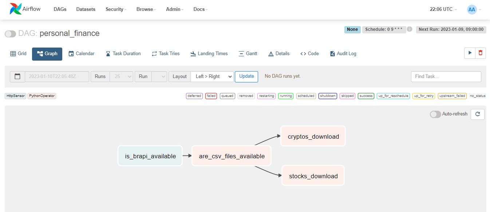
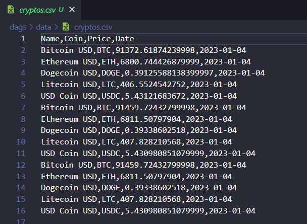
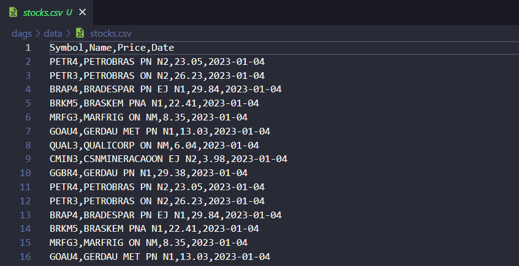

## Data Pipeline de Finanças com Apache Airflow
 Data Pipeline automatizado que extrai o valor atual das ações da bolsa de valores e armazena o resultado em um arquivo csv.

## Propósito
- Esse projeto tem como finalidade o desenvolvimento de um job ETL automatizado que armazene dados para serem consumidos por ferramentas de analytics.
- Trabalhar com o orquestrador de workflows Apache Airflow.
- Facilitar o acompanhamento das ações de minha carteira de investimentos.

## Informações
- Esse Data Pipeline Consome dados de uma API chamada "brapi" que fornece informações sobre ações, criptos... Você pode conhecer mais em: [brapi](https://brapi.dev/) . Após realizar as requisições das seguintes ações: 'PETR4', 'PETR3', 'BRAP4', 'BRKM5', 'MRFG3', 'GOAU4', 'QUAL3', 'CMIN3', 'GGBR4'. E cripto moedas: 'BTC', 'ETH', 'DOGE', 'LTC', 'USDC'. Armazena os dados em um arquivo csv.
- Dados Armazenados: 
    - Name (Nome completo da ação/cripto);
    - Coin (Abreviatura da cripto);
    - Symbol(Abreviatura da ação);
    - Price (Preço ação/cripto);
    - Date (Data da requisição).

## Funcionamento
1. HttpSensor para verificar se a API da Brapi está disponível.
2. PythonOperator para verificar se já existe os aquivos csv 'stocks.csv' (ações) e 'cryptos.csv' (criptomoedas), na pasta "data/", que irão armazenar os dados, se não existir serão criados.
3. Por fim, outro PythonOperator para baixar os dados e escrever nos arquivos.

## Tecnologias Usadas
- Docker;
- Apache Airflow;
- Requests library;

## Imagens






## Como Executar
Requisitos: possuir docker, docker-compose e git instalados.

Clonar repositório: 
```
git clone https://github.com/gabrielpedrosati/airflow-personal-finance.git
```
Executar no PowerShell na pasta do repositório do git:
```
 docker-compose up
```
```
Acessar localhost:8080, login user: airflow, password: airflow, ir em DAGS e executar.
```

## Contato
Pode me contatar em: [Gabriel Pedrosa](https://www.linkedin.com/in/gabrielpedrosati/).
